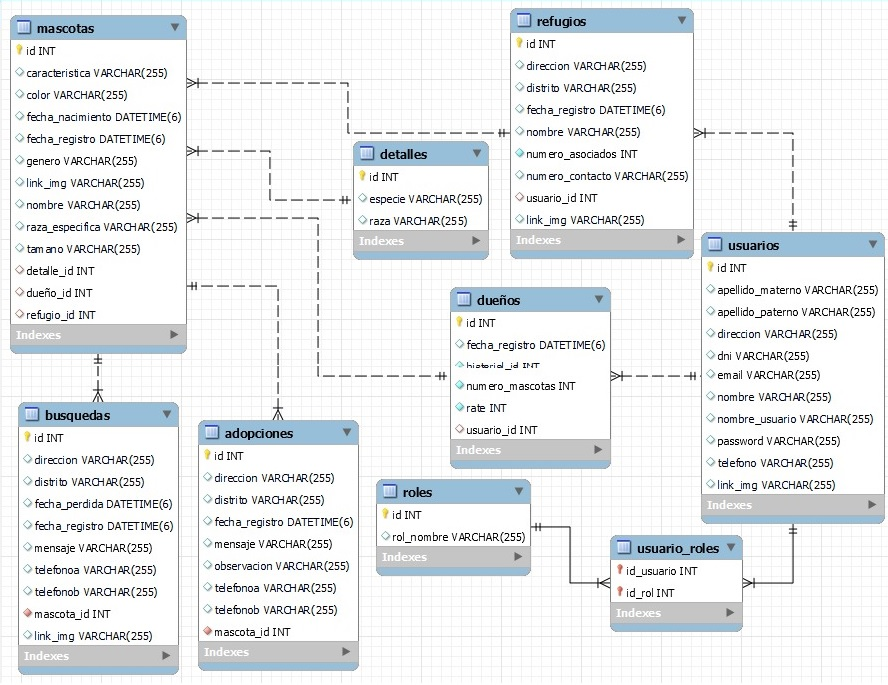

# Spring Mascotas Perdidas Backend v1.0

Proyecto backend para el Sistema Mascotas Perdidas

## Descripción

Para la realización de este proyecto se usó Spring Boot v2.6.4.

## Inicio

### Dependencias

* Spring v2.5.6, Spring JPA, MySQL driver, Java 8 (deseable).
* Sistema Operativo Idependiente

### Instalación

* Clonar el repositorio
```
git clone https://github.com/Capdoo/spring-mascotas-backend.git

```

* Crear la Base de Datos usando MySQL
```
CREATE DATABASE mascotasBD CHARACTER SET utf8 COLLATE utf8_general_ci;

```


### Editar las propiedades

* Es necesario modificar el archivo application.properties
* Se debe indicar el nombre de usuario y contraseña de la Base de Datos

```
spring.datasource.url=jdbc:mysql://localhost:3306/mascotasBD
spring.datasource.username=[Su username]
spring.datasource.password=[Su contraseña]
spring.datasource.driver-class-name=com.mysql.cj.jdbc.Driver

```

## Ejecución

Iniciar el proyecto a través de Spring Tools, Eclipse IDE o IntelliJ IDEA
```
Click derecho en el proyecto
Run As
Spring Boot App
```


## Base de Datos


## Authors

Contribuidores y enlaces

. [@Capdoo](https://github.com/Capdoo)


## License

This project is licensed under the [NAME HERE] License - see the LICENSE.md file for details

## Acknowledgments

El fundamento de Spring JPA.
* [Spring One To Many - Baeldung](https://www.baeldung.com/hibernate-one-to-many)
