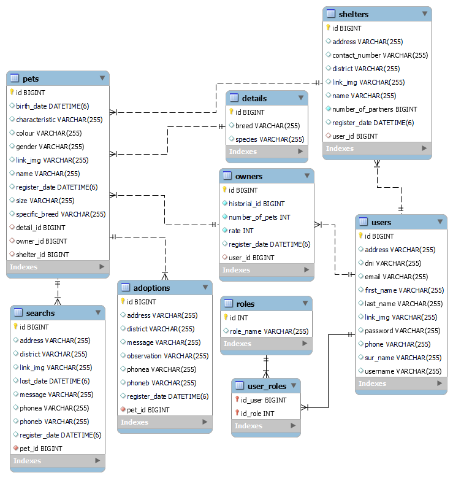

# Spring Mascotas Perdidas Backend v1.0

Proyecto backend para el Sistema Mascotas Perdidas

## Despliegue

* [Mascotas Deploy Swagger](https://spring-adopciones-backend.herokuapp.com/swagger-ui/index.html)


## Descripción

Para la realización de este proyecto se usó Spring Boot v2.6.2.

## Inicio

### Dependencias

* Spring v2.6.2, Spring JPA, MySQL driver, Java 8 u 11.
* Sistema Operativo Independiente

### Instalación

* Clonar el repositorio
```
git clone https://github.com/Capdoo/spring-mascotas-backend.git
```

* Crear la Base de Datos usando MySQL
```
CREATE DATABASE mascotasBD CHARACTER SET utf8 COLLATE utf8_general_ci;
```


### Editar las propiedades

* Es necesario modificar el archivo application.properties
* Se debe indicar el nombre de usuario y contraseña de la Base de Datos

```
spring.datasource.url=jdbc:mysql://<host>:<port>/mascotasBD
spring.datasource.username=<username>
spring.datasource.password=<password>
spring.datasource.driver-class-name=com.mysql.cj.jdbc.Driver
```

## Ejecución

Iniciar el proyecto a través de cualquier IDE.
```
Actualizar las dependencias (pom.xml)
Cambiar la configuración en propiedades
Hacer build
```


## Base de Datos


## Authors

Contribuidores y enlaces

. [@Capdoo](https://github.com/Capdoo)


## License

This project is licensed under the terms of the MIT license.

## Acknowledgments

Spring Data e Hibernate
* [Spring One To Many - Baeldung](https://www.baeldung.com/hibernate-one-to-many)
